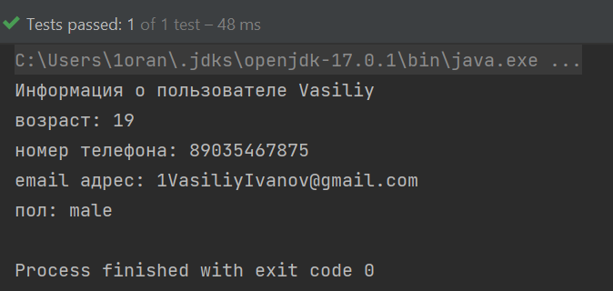

# Практическая работа 31. Тестирование

**Студент**: Исаев Илья Павлович, isaev-ip@bk.ru.

## Решение задания на практическую работу

В результате тестирования проекта ошибки не были выявлены, все задуманные системы и методы работаю в соответствии с ожиданиями тестировщика.

Классы для тестов, написанные до изучения JUnit показывают аналогичные результаты, что и тестирование при помощи JUnit.
